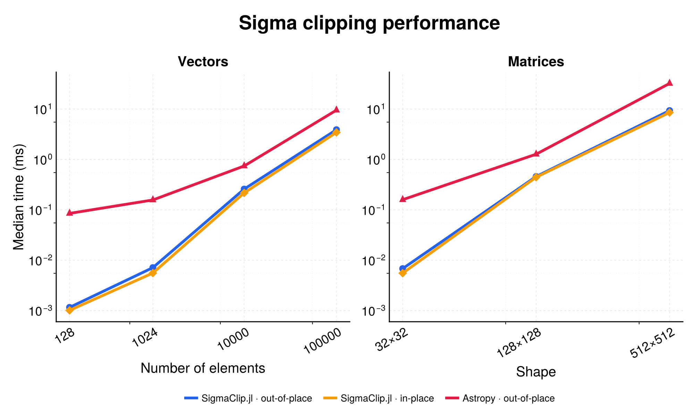

# SigmaClip.jl

SigmaClip.jl removes outliers from numeric arrays with iterative sigma clipping.
It supports clipped copies, in-place clipping, masks, bounds, reusable buffers,
and custom center or spread functions. There are no runtime dependencies.

## Installation

```julia
using Pkg
Pkg.add("SigmaClip")
```

## Quick start

```julia
using SigmaClip

data = [1.0, 1.0, 1.0, 50.0, NaN]

sigma_clip(data)
# [1.0, 1.0, 1.0, NaN, NaN]

sigma_clip_mask(data)
# Bool[true, true, true, false, false]

sigma_clip_bounds(data)
# (1.0, 1.0)
```

`sigma_clip`, `sigma_clip_mask`, and `sigma_clip_bounds` leave `data` unchanged.
Use `sigma_clip!` to replace rejected values in a floating-point array with
`NaN`, or `sigma_clip_mask!` to reuse a boolean target array.

## API

| Function | Result |
| :--- | :--- |
| `sigma_clip(x)` | Clipped copy; integer inputs become floating point. |
| `sigma_clip!(x)` | Modifies `x` by replacing rejected values with `NaN`. |
| `sigma_clip_mask(x)` | `BitArray` where `true` means retained. |
| `sigma_clip_mask!(x, target)` | Writes the mask into `target`. |
| `sigma_clip_bounds(x)` | Final `(lower, upper)` clipping bounds. |

All clipping functions accept these keywords:

| Keyword | Default | Meaning |
| :--- | :--- | :--- |
| `workspace` | `nothing` | Reusable `SigmaClipWorkspace`. |
| `exclude` | `nothing` | Boolean array; `true` excludes a value from bound estimation. |
| `sigma_lower` | `3` | Positive lower rejection threshold. |
| `sigma_upper` | `3` | Positive upper rejection threshold. |
| `center` | `fast_median!` | Center function. |
| `spread` | `mad_std!` | Spread function. |
| `maxiter` | `5` | Iteration limit; `-1` runs until convergence. |

Excluded values are still classified against the final bounds:

```julia
data = [-100.0, 0.0, 0.0, 0.0, 50.0]
exclude = Bool[true, false, false, false, true]

sigma_clip_mask(data; exclude)
# Bool[false, true, true, true, false]
```

Lower and upper thresholds can differ:

```julia
sigma_clip!(data; sigma_lower = 2, sigma_upper = 4)
```

## Reusing workspace

Allocate buffers once when clipping many arrays of the same maximum size:

```julia
image = randn(128, 1024)
workspace = SigmaClipWorkspace(
    Vector{Float64}(undef, size(image, 2)),
    Vector{Float64}(undef, size(image, 2)),
)

for row in eachrow(image)
    sigma_clip!(row; workspace)
end
```

The main buffer must have the same element type as the input and at least as
many elements. The auxiliary buffer is required by `mad_std!`; pass `nothing`
when using a spread function that does not need it.

```julia
using Statistics

workspace = SigmaClipWorkspace(similar(data), nothing)
sigma_clip_bounds(data; workspace, spread = std)
```

## Custom statistics

Any callable that accepts an `AbstractVector` and returns a scalar can be used
as `center` or `spread`:

```julia
using Statistics

iqr_spread(v) = (quantile(v, 0.75) - quantile(v, 0.25)) / 1.349
sigma_clip(data; center = mean, spread = iqr_spread)
```

`fast_median!` and `mad_std!` are also exported for direct use. Both may reorder
their input. Calls through SigmaClip operate on the workspace, not the user's
array.

## License

SigmaClip.jl is licensed under the MIT License. See [LICENSE](LICENSE).

## Performance

Benchmark comparison with [Astropy](https://www.astropy.org/):


