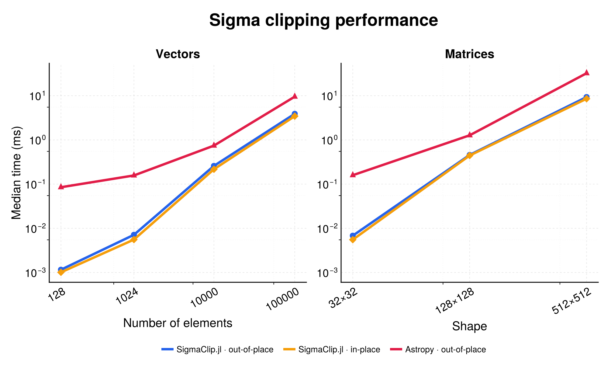

# SigmaClip.jl

[](https://github.com/m4ttes4/SigmaClip.jl/actions/workflows/CI.yml)
[](https://codecov.io/gh/m4ttes4/SigmaClip.jl)
[](https://m4ttes4.github.io/SigmaClip.jl/dev/)
[](https://juliahub.com/ui/Packages/General/SigmaClip)

SigmaClip.jl finds outliers in numeric arrays with iterative sigma clipping.
It returns clipped copies, clips in place, builds validity masks, reports the
final clipping bounds, and computes statistics on the retained values. Scratch
buffers can be reused across calls, and the center and spread estimators can be
replaced with any function. The package has no runtime dependencies.

## Installation

```julia
using Pkg
Pkg.add("SigmaClip")
```

## Quick start

```julia
using SigmaClip

data = [0, 1, 2, 3, 4, 5, 6, 50, NaN, Inf]

sigma_clip(data, 3, 3)             #== sigma_clip(data, lower, upper), or sigma_clip(data, 3)
# [0.0, 1.0, 2.0, 3.0, 4.0, 5.0, 6.0, NaN, NaN, NaN]

sigma_clip_mask(data, 3)        # validity mask: true = finite and retained
# Bool[1, 1, 1, 1, 1, 1, 1, 0, 0, 0]

sigma_clip_bounds(data, 3)
# (-5.89561331103361, 11.89561331103361)

sigma_clipped_stats(data, 3)
# (center = 3.0, spread = 2.9652044370112036)
```

By default the center is the median and the spread is the median
absolute deviation scaled to a normal standard deviation, with at most 5
iterations. See the [documentation](https://m4ttes4.github.io/SigmaClip.jl/dev/)
for how the algorithm treats non-finite and excluded values, in-place clipping,
custom statistics, reusable workspaces, and the API reference.

## Performance

Benchmark comparison with [Astropy](https://www.astropy.org/):



## License

SigmaClip.jl is licensed under the MIT License. See [LICENSE](LICENSE).
